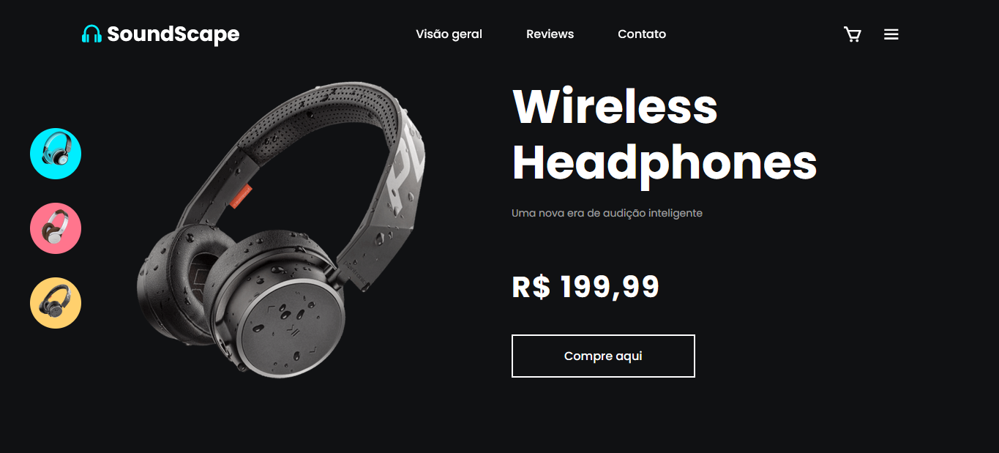

# SoundScape

SoundScape é um projeto de loja online de fones de ouvido que oferece uma nova era de audição inteligente. Este projeto foi desenvolvido como parte de um exercício de prática de desenvolvimento web.

## Funcionalidades

- Exibição de fones de ouvido wireless com imagens e descrições.
- Navegação entre diferentes opções do produto.
- Menu suspenso para acesso rápido a diferentes seções do site.

## Tecnologias Utilizadas

- HTML
- CSS (com BoxIcons)
- JavaScript

## Vizualização

- Acesse o deploy para visualizar a página: https://jessicasamppaio.github.io/loja-headphones/

## Autora
Jéssica Sampaio

